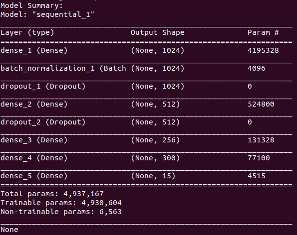
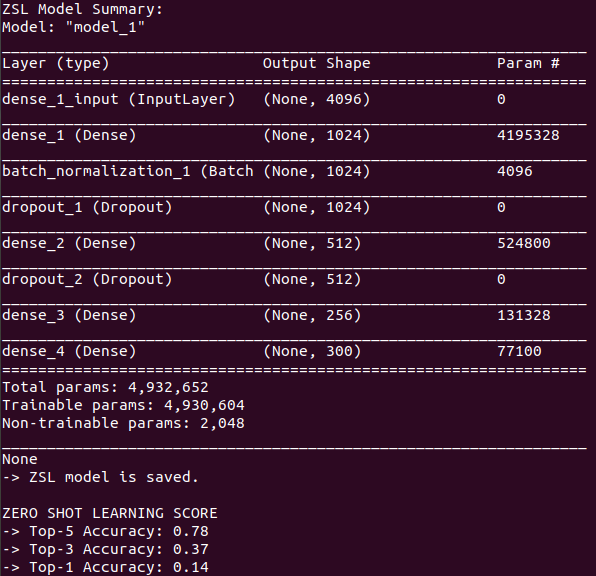

# Academic Project (CS244-Introduction to data science)
### Image classification: Zero-shot Image Recognition Using Relational Matching, Adaptation and Calibration

## zero-shot-learning
Implementation of Zero-Shot Learning algorithm  

  
Zero-Shot learning method aims to solve a task without receiving any example of that task at training phase.  
It simply allows us to recognize objects *we have not seen before*.  
  
### Classes  
**Train Classes:**  
arm, boy, bread, chicken, child, computer, ear, house, leg, sandwich, television, truck, vehicle, watch, woman  
**Zero-Shot Classes:**  
car, food, hand, man, neck  
  
### Usage  
$ **python3**  detect_object.py  input-image-path  
  
### Example  
$ **cd**  src  
$ **python3**  detect_object.py  ../test.jpg
**->** --- Top-5 Prediction ---  
**->** 1- vehicle  
**->** 2- truck  
**->** 3- car  
**->** 4- house  
**->** 5- watch  
  

*Test image is a beautiful green Jaguar.*  
*All related prediction results are ranked in first three.* 
  
P.S. Remember, the prediction results are only allowed to be among above classes (train and zero-shot classes).  
Algorithm will fail (although it will do its best to predict most related class) in case you try to detect an object from different other classes.

### Model Summary 

### ZSL Model Summary
